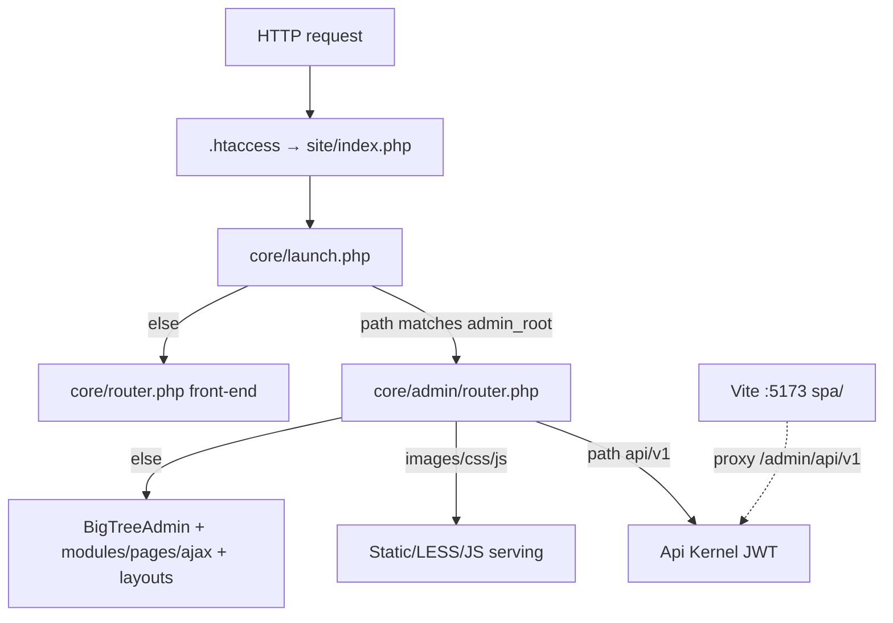
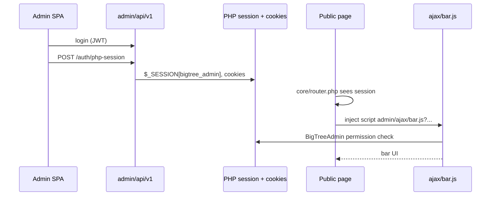
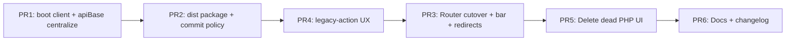

# Ship BigTree Admin SPA at `/admin` and Remove Legacy PHP Admin Routing

| Field | Value |
| --- | --- |
| **Author** | Engineering (remaster admin cutover) |
| **Date** | 2026-07-12 |
| **Status** | Draft (open questions resolved) |
| **Branch context** | `remaster` (workspace); legacy admin reference = **`master`** |
| **Primary code areas** | `core/admin/router.php`, `core/launch.php`, `spa/`, `core/inc/bigtree/services/AuthService.php`, front-end bar in `core/router.php`, `core/admin/ajax/developer/upgrade/` |

---

## Overview

BigTree 5’s React admin SPA (`spa/`) is production-ready as a product surface but is only runnable today via `npm run dev` (or an undocumented Apache `Alias` at `/admin/spa/`). Classic PHP admin routing still owns `/admin/*` through `core/admin/router.php` after the early REST API branch.

This design ships the **built SPA at the site’s configured admin root** (default path `/admin`), served portably by the existing BigTree front controller — **not** via host-specific Apache-only aliases as the long-term path. Concurrently it **removes classic PHP admin UI routing** (modules, pages, layouts, classic ajax UI). The REST API at `{admin}/api/v1` remains. A **minimal non-UI PHP surface** is retained for the front-end BigTree bar, session bridge, upgrade migration scripts (filesystem, not UI), field-type process/draw/settings trees used by the API, and static asset serving.

This is a **hard cut**, not a dual-run / feature-flag coexistence of classic UI and SPA. Rollback is git-level (revert to pre-cutover commit or reference `master` for legacy admin code), gated by a safe deploy checklist that refuses to switch the router if SPA assets are missing.

---

## Background & Motivation

### Current architecture



| Layer | Location | Role today |
| --- | --- | --- |
| Front controller | `site/index.php` → `core/launch.php` | Detects admin via `admin_root` path segments; includes `custom/admin/router.php` or `core/admin/router.php` |
| Admin router | `core/admin/router.php` (~580 lines) | (1) API v1 (2) extension `*` assets (3) images/css/js (4) full classic admin |
| REST API | `core/inc/bigtree/api/` + `services/` | JWT; forever required |
| Upgrade migrations | `core/admin/ajax/developer/upgrade/**` | Loaded by `MigrationService` / `SystemService` / CLI — **not** dead UI |
| SPA source | `spa/` | React 18 + TS + Tailwind; Vite 5 |
| SPA prod assumptions | `vite.config.ts` `base: "/admin/spa/"`, router `basename: "/admin/spa"` | Documented Apache Alias only; `spa/dist` gitignored; `build.sourcemap: true` |

### Pain points

1. **SPA is not shippable** for real installs: no portable production serving path in the product tree.
2. **Wrong production URL**: SPA lives under `/admin/spa` while product goal is **`/admin`**.
3. **Apache Alias is non-portable**: BigTree ships as a CMS for shared hosts / nginx / IIS-adjacent stacks; Alias + `FallbackResource` cannot be the only story.
4. **Classic admin is redundant** with the SPA for core surfaces (dashboard, pages, modules auto UI, developer, users, files, settings, tags, messages, login, embed forms).
5. **Half-migrated escape hatches** still deep-link into classic admin (`legacyActionUrl`, bar “Edit Content” iframe, “Edit in BigTree” → `/admin/pages/edit/...`).
6. **Hardcoded API roots** in more than one SPA module (`client.ts`, `useUploads.ts`) break subdirectory installs.

### Confirmed product decision

- **Kill the legacy CMS admin UI.** Do not plan long-term dual-run.
- Reference **`master`** if legacy admin PHP must be consulted later.
- Implementation **must remove classic admin PHP routing** (the post-API branch that boots `BigTreeAdmin` and routes modules/pages/ajax UI) — without deleting non-UI assets the services layer still loads from disk.

---

## Goals & Non-Goals

### Goals

1. Serve the production SPA at **`{admin_root}`** (default URL path `/admin`), including client-side routes and **deep-link hard reloads** with correct asset URLs.
2. Change SPA `base` / React Router `basename` from `/admin/spa` → admin root (with correct subdirectory installs).
3. Produce, store, and serve built assets in a **portable** way via PHP front controller (works without Apache `Alias`).
4. Rewrite `core/admin/router.php` to: **API first → minimal bar/static surfaces → SPA static + `index.html` fallback**. No classic page/module UI routing.
5. Define explicit **delete vs keep** lists for `core/admin/**` (including upgrade revisions and full field-type trees).
6. Define **build / release / CI** for shipping `spa` output without requiring Node on production hosts; keep CI smoke green after cutover.
7. Resolve **auth / PHP session / front-end bar** implications of killing classic UI, including a **session-based bar logout**.
8. Define **policy for legacy custom PHP module actions** (`render: "server"`) and ship UX **before or with** cutover.
9. Define **rollback** without dual-run feature flags, with a safe deploy story.
10. Cover **subdirectory / custom `admin_root`** installs (e.g. `https://example.com/remaster/admin/`).
11. Provide a **verification checklist** and ordered **PR plan**.

### Non-Goals

- Rewriting the REST API or moving it off `{admin}/api/v1`.
- Replacing `BigTreeAdmin` / `BigTreeCMS` god-classes used by services (core remains frozen; processField etc. stay).
- Porting every historical custom PHP module action to SPA module JS in this project (policy + UX only).
- Rebuilding the front-end overlay editor as a full SPA iframe experience in the same cut (see bar recommendation).
- Multi-site alternate-domain CORS login hand-off (`multi_site_login_key` / SPA cross-domain session). **Product:** follow-up after cutover; 5.0 accepts SPA login per domain. Not in this PR train.
- Runtime developer-status warning when `custom/admin/router.php` exists — **docs only** for the override contract.
- Deleting `core/inc/bigtree/admin.php`, field-type trees under `core/admin/field-types/`, or upgrade revision scripts under `core/admin/ajax/developer/upgrade/`.
- Relocating migrations to a new directory in the cutover train (optional later PR only).
- Supporting IE or non-modern browsers for the admin SPA.

---

## Proposed Design

### High-level target architecture

```mermaid
flowchart TD
  REQ[HTTP request under admin_root] --> LP[core/launch.php]
  LP --> R[core/admin/router.php]

  R -->|path[1]=api AND path[2]=v1| API[Api\Kernel]
  R -->|classic→SPA redirect map| REDIR[302 to SPA path]
  R -->|ajax/bar.js or bar-logout or css/bar.css / bar images| BAR[Minimal bar surface]
  R -->|reserved static under dist| STATIC[Serve spa dist file + placeholder rewrite]
  R -->|everything else GET/HEAD| SPA[index.html + boot config + placeholder rewrite]
  R -->|unknown POST to non-API| HTTP404[404 JSON/text]

  FE[Public site core/router.php] -->|injects| BARJS["script …/ajax/bar.js"]
  SPA_APP[SPA in browser] -->|JWT| API
  SPA_APP -->|POST /auth/php-session| API
  API -->|sets PHP session cookies| FE
  BAR -->|POST bar-logout| SessClear[Clear PHP session + cookies]
```

### 1. SPA base / basename / asset URLs

**Today (hardcoded `/admin/spa` and `/admin/api/v1`):**

| File | Current |
| --- | --- |
| `spa/vite.config.ts` | `base: mode === "production" ? "/admin/spa/" : "/"`; `build.sourcemap: true` |
| `spa/src/routes/index.tsx` | `basename: import.meta.env.PROD ? "/admin/spa" : "/"` |
| `spa/src/pages/developer/debug/DebugEmulator.tsx` | `"/admin/spa/dashboard"` in prod |
| `spa/src/renderer/fields/HTMLField.tsx` | `import.meta.env.BASE_URL` for TinyMCE |
| `spa/src/renderer/forms/fieldSandboxProtocol.ts` | `import.meta.env.BASE_URL` for field-sandbox |
| `spa/src/api/client.ts` | `const BASE = "/admin/api/v1"` |
| `spa/src/hooks/useUploads.ts` | **Independent** `const BASE = "/admin/api/v1"` (uploads bypass shared helper) |
| `spa/src/api/client.test.ts` | Expects `/admin/api/v1/...` |

**Problem for subdirectory installs:** `admin_root` may be `https://bigtree.com/remaster/admin/` (`custom/environment.php` in this workspace). Hardcoding `/admin/...` breaks those installs for assets, API, and uploads.

#### Why bare `base: "./"` is insufficient

With history-mode routing, a hard reload at `/remaster/admin/pages/3/edit` makes the browser resolve `./assets/index-….js` against **`/remaster/admin/pages/3/`**, not the admin root. Injecting `basename` / `apiBase` into JS does **not** fix `<script src>` / `<link href>` already written into `index.html`, nor `import.meta.env.BASE_URL` baked into the bundle for TinyMCE/sandbox.

#### Chosen strategy: build-time placeholder base + serve-time rewrite

1. **Vite production `base`** is a **reserved absolute placeholder**, not `./` and not a real install path:

   ```ts
   // spa/vite.config.ts (production only — flip with cutover, see PR plan)
   base: "/__BIGTREE_ADMIN_BASE__/",
   build: {
     sourcemap: false, // production packaging — see §2 / Security
   },
   ```

   Vite then emits:

   - `index.html` → `/__BIGTREE_ADMIN_BASE__/assets/index-XXXX.js`
   - `import.meta.env.BASE_URL` → `"/__BIGTREE_ADMIN_BASE__/"` (TinyMCE, field-sandbox, etc.)

2. **PHP rewrites the placeholder** when serving **text** files from `core/admin/dist` (and when serving `index.html` for SPA fallback):

   ```php
   const BIGTREE_ADMIN_BASE_TOKEN = "/__BIGTREE_ADMIN_BASE__";

   function rewrite_admin_base(string $contents, string $admin_path): string {
   	// $admin_path e.g. "/remaster/admin" or "/admin" (no trailing slash)
   	return str_replace(BIGTREE_ADMIN_BASE_TOKEN, $admin_path, $contents);
   }
   ```

   Apply rewrite for Content-Types that can embed the token: `text/html`, `text/css`, `text/javascript` / `application/javascript`, `application/json` if any. **Do not** rewrite binary (images, fonts, wasm). Optionally skip rewrite if `strpos($contents, BIGTREE_ADMIN_BASE_TOKEN) === false` for speed.

3. **PHP also injects runtime boot config** into `index.html` (for React Router basename + API client; paths already absolute after rewrite for assets):

   ```php
   $boot = [
   	"basename" => $admin_path,              // "/remaster/admin"
   	"apiBase" => $admin_path . "/api/v1", // "/remaster/admin/api/v1"
   	"wwwRoot" => $bigtree["config"]["www_root"] ?? "",
   	"assetBase" => $admin_path . "/",     // convenience; matches rewritten BASE_URL
   ];
   $boot_json = json_encode(
   	$boot,
   	JSON_HEX_TAG | JSON_HEX_AMP | JSON_HEX_APOS | JSON_UNESCAPED_SLASHES
   );
   // inject: <script>window.__BIGTREE_ADMIN__=<?=$boot_json?>;</script>
   ```

4. **SPA boot helper** — all API URL construction goes through one place:

```ts
// spa/src/lib/adminBoot.ts
export interface BigTreeAdminBoot {
	basename: string;
	apiBase: string;
	wwwRoot?: string;
	assetBase?: string;
}

export const getAdminBoot = (): BigTreeAdminBoot => {
	if (import.meta.env.DEV) {
		return { basename: "", apiBase: "/admin/api/v1", assetBase: "/" };
	}

	return (
		window.__BIGTREE_ADMIN__ ?? {
			basename: "/admin",
			apiBase: "/admin/api/v1",
			assetBase: "/admin/",
		}
	);
};

/** Single source for fetch paths — used by client.ts AND useUploads.ts */
export const apiBase = (): string => getAdminBoot().apiBase;
```

```ts
// spa/src/api/client.ts
import { apiBase } from "@/lib/adminBoot";
// use apiBase() per request (or cache once at module init after boot script ran)
```

```ts
// spa/src/hooks/useUploads.ts — MUST use apiBase(); delete local BASE constant
```

5. **Remove** hardcoded `/admin/spa` in `DebugEmulator.tsx` — `getAdminBoot().basename + "/dashboard"` or React Router navigation.

6. **Grep gate for PR1/PR3:** no remaining `/admin/spa` or bare `"/admin/api/v1"` under `spa/src` except dev defaults inside `adminBoot.ts` and intentional comments. Update `client.test.ts` to mock `getAdminBoot` / assert via `apiBase()`.

7. **Dev server:** Vite `base: "/"`; proxy of `/admin/api/v1` unchanged. Placeholder base is **production-only**.

8. **Alternatives rejected for primary path:**
   - **`base: "./"` alone** — deep-link reload breaks (Issue 1).
   - **`<base href>` alone** — can work for relative URLs but interacts poorly with some client libs and is easier to get wrong with React Router; placeholder rewrite is more explicit for implementers.
   - **Build-time absolute `/admin/` only** — breaks subdirectory installs.

### 2. Where built assets live

| Option | Pros | Cons |
| --- | --- | --- |
| A. Serve from `spa/dist/` (gitignored) | Simple for devs | Production/tarball must run Node or CI copy; easy to ship without assets |
| B. **Copy build → `core/admin/dist/`** (recommended) | Shipped with core; PHP path stable; production hosts need no `spa/` source or Node | Release process must copy artifacts; two trees if someone forgets to rebuild |
| C. Commit `spa/dist` in repo | Always present | Noisy diffs; path couples prod to spa layout |

**Decision: Option B — production artifact directory `core/admin/dist/`.**

**Commit policy (resolved):** After cutover lands, **`core/admin/dist/` is committed continuously on `remaster`** (and release tags). Rationale: clone-and-run without Node; smoke CI and local PHP server work without an extra artifact hop; BigTree tarball packaging already ships `core/`.

- `spa/` remains the **source** package (dev + CI typecheck/test).
- `npm run build` emits to `spa/dist` (scratch, remains gitignored).
- Packaging script **syncs** to `core/admin/dist/` (rsync/`cp -R`), **excluding `*.map`** even if a developer enables maps locally.
- **CI staleness gate (recommended):** after `npm run build` in the spa job, `diff -rq` (or hash compare of `index.html` + asset manifest) between `spa/dist` and `core/admin/dist` fails the job if packaging was forgotten. Alternatively the spa job always re-packages and the job fails if `git status --porcelain core/admin/dist` is dirty (forces commit in same PR).
- Router resolves: `SERVER_ROOT . "core/admin/dist/"`.
- **Production sourcemaps:** `build.sourcemap: false` in production Vite config used for packaging. Do **not** serve `*.map` from the admin router (if present, refuse or omit from package). CI may keep a separate debug artifact with maps if needed — not under `core/admin/dist`.

**Artifact layout after packaging (illustrative):**

```
core/admin/dist/
  index.html          # contains /__BIGTREE_ADMIN_BASE__/… until PHP rewrite
  favicon.svg
  assets/index-XXXX.js
  assets/index-XXXX.css
  assets/react-vendor-XXXX.js
  tinymce/...
  field-sandbox/...
  sdk/...
  field-modules/...
  # no *.map
```

**Local PHP-served admin after cutover:**

```bash
cd spa && npm ci && npm run build
# package script:
./scripts/package-admin-spa.sh   # spa/dist → core/admin/dist, strip maps
# then exercise via normal BigTree vhost / php -S + ci-router
```

### 3. New `core/admin/router.php` behavior

**Ordering (strict):**

1. Pad `$bigtree["path"]` as today.
2. **REST API** — unchanged early exit to `Kernel` (no session).
3. **Extension asset prefix `*`** — keep (extensions ship css/js/images under extension roots via `ADMIN_ROOT*/{ext}/...`).
4. **Classic → SPA redirect map** (GET/HEAD only, before SPA fallback) — see § Classic URL redirects.
5. **Minimal bar surface** (bootstrap + session required for permission / logout):
   - `ajax/bar.js` → `core/admin/ajax/bar.js.php`
   - `ajax/bar-logout` → new session logout (required; see §5)
   - `css/bar.css` + bar images
6. **SPA static files** from `core/admin/dist/` with placeholder rewrite for text types.
7. **SPA fallback** for `GET`/`HEAD` when no file matches → serve rewritten `index.html` + boot injection.
8. **No classic UI** — do not construct `BigTreeAdmin` for HTML modules/pages; do not include layouts; do not HTTP-route `/ajax/*` UI endpoints (except bar + bar-logout). Upgrade scripts remain on disk for **CLI / API services** only — not routed as classic ajax UI.

**Pseudocode:**

```php
<?php
define("BIGTREE_ADMIN_ROUTED", true);

if (!isset($bigtree["config"]["static_root"])) {
	$bigtree["config"]["static_root"] = $bigtree["config"]["www_root"];
}

$bigtree["path"] = array_pad($bigtree["path"], 4, "");

// 1) REST API — unchanged
if ($bigtree["path"][1] === "api" && $bigtree["path"][2] === "v1") {
	if (file_exists("../custom/bootstrap.php")) {
		include "../custom/bootstrap.php";
	} else {
		include "../core/bootstrap.php";
	}

	require BigTree::path("inc/bigtree/api/Kernel.php");
	BigTree\Api\Kernel::handle($bigtree["path"]);
	die();
}

// 2) Extension * asset context
if ($bigtree["path"][1] == "*") {
	define("EXTENSION_ROOT", $server_root."extensions/".$bigtree["path"][2]."/");
	$bigtree["extension_context"] = $bigtree["path"][2];
	$bigtree["path"] = array_merge([$bigtree["path"][0]], array_slice($bigtree["path"], 3));
	// fall through to extension static serving (existing images/css/js under EXTENSION_ROOT)
	// then die — do not serve SPA dist for extension asset requests
}

$admin_path = rtrim(parse_url($bigtree["config"]["admin_root"], PHP_URL_PATH) ?: "/admin", "/");
$admin_subpath = array_slice($bigtree["path"], 1);
$admin_rel = implode("/", array_filter($admin_subpath, fn($s) => $s !== ""));

// 3) Classic bookmark redirects (GET/HEAD)
if (in_array($_SERVER["REQUEST_METHOD"] ?? "GET", ["GET", "HEAD"], true)) {
	if ($location = classic_to_spa_redirect($admin_subpath, $admin_path)) {
		header("Location: ".$location, true, 302);
		die();
	}
}

// 4) Minimal bar surface
if (is_bar_request($bigtree["path"])) {
	bootstrap_admin_minimal();
	serve_bar_endpoint($bigtree["path"]);
	die();
}

// 5–7) SPA dist
$dist_root = realpath($server_root."core/admin/dist");
if ($dist_root === false || !is_dir($dist_root)) {
	http_response_code(503);
	header("Content-Type: text/plain; charset=utf-8");
	echo "BigTree admin UI is not installed (missing core/admin/dist). Run the SPA production build and package-admin-spa.";
	die();
}

$file = resolve_dist_file($dist_root, $admin_rel);

if ($file !== null) {
	$real = realpath($file);
	$dist_prefix = $dist_root.DIRECTORY_SEPARATOR;
	if ($real !== false && ($real === $dist_root || str_starts_with($real, $dist_prefix))) {
		// Refuse source maps
		if (str_ends_with(strtolower($real), ".map")) {
			http_response_code(404);
			die("Not found.");
		}
		serve_static_file($real, $admin_path); // applies placeholder rewrite for text types
		die();
	}
}

$method = $_SERVER["REQUEST_METHOD"] ?? "GET";
if ($method === "GET" || $method === "HEAD") {
	serve_spa_index($dist_root.DIRECTORY_SEPARATOR."index.html", $admin_path, $bigtree["config"]);
	die();
}

http_response_code(404);
header("Content-Type: text/plain; charset=utf-8");
echo "Not found.";
die();
```

#### Static serving contract

| Concern | Contract |
| --- | --- |
| **Path resolve** | Join `$dist_root` + normalized relative segments; reject empty `..`, null bytes, absolute segments; `realpath` + prefix check using `$dist_root . DIRECTORY_SEPARATOR` (not bare `str_starts_with($real, $dist_root)` alone — avoids `/dist-evil` false prefix). |
| **Directories** | If `$admin_rel` names a directory (or ends with `/`), **do not** list it — fall through to SPA `index.html` (GET/HEAD) or 404 (other methods). |
| **Missing file** | Fall through to SPA fallback for GET/HEAD; 404 for POST/PUT/PATCH/DELETE. |
| **HEAD** | Same headers as GET for static files; **empty body**. SPA index HEAD: headers only, no body. |
| **Source maps** | Never serve `*.map` (404). Packaging strips them. |
| **Placeholder rewrite** | On text responses only; token `/__BIGTREE_ADMIN_BASE__` → `$admin_path`. |
| **MIME allowlist (minimum)** | `.html` → `text/html; charset=utf-8`; `.js` / `.mjs` → `text/javascript; charset=utf-8`; `.css` → `text/css; charset=utf-8`; `.svg` → `image/svg+xml`; `.png`/`.jpg`/`.gif`/`.webp`/`.ico` → image/*; `.woff2` → `font/woff2`; `.woff` → `font/woff`; `.ttf` → `font/ttf`; `.json` → `application/json`; unknown → `application/octet-stream` or 404 for non-allowlisted extensions (prefer allowlist to avoid serving accidental PHP/config). |
| **Cache policy** | `index.html` (SPA document): `Cache-Control: no-store` (or `no-cache`). Hashed files under `assets/`: `Cache-Control: public, max-age=31536000, immutable`. Other static (tinymce, sdk): long-cache if filename content-hashed; otherwise short revalidate. |
| **Extension `*` path** | Handled **before** dist lookup; serves from `EXTENSION_ROOT` / custom/core admin asset trees as today; never maps extension URLs into `core/admin/dist`. |

**`serve_spa_index`:** read file, `rewrite_admin_base`, inject boot script with safe `json_encode` flags (`JSON_HEX_TAG | JSON_HEX_AMP | JSON_HEX_APOS | JSON_UNESCAPED_SLASHES`), `Content-Type: text/html; charset=utf-8`, no-store cache headers.

**Collision avoidance / reserved first segments:**

| Reserved under admin | Owner |
| --- | --- |
| `api/` | REST API |
| `ajax/bar.js`, `ajax/bar-logout` | Bar |
| `css/bar.css` | Bar |
| `images/` (bar sprites) | Bar (scoped filenames) or copied bar-assets |
| `*/` (first segment `*`) | Extension assets |

#### Classic URL redirects (PR3, required minimal map)

Before SPA fallback, map high-traffic classic shapes to SPA paths (302):

| Classic path (after admin) | SPA target |
| --- | --- |
| `` (empty) / `dashboard` / `dashboard/` | `{admin_path}/dashboard` |
| `login` / `login/` | `{admin_path}/login` |
| `pages/edit/{id}` | `{admin_path}/pages/{id}/edit` |
| `pages/add/{parent}` | `{admin_path}/pages/add/{parent}` |
| `logout` / `login/logout` | Prefer bar-logout / SPA login — redirect `login/logout` → `{admin_path}/ajax/bar-logout` or SPA `/login` after session clear |

Unmapped classic URLs still get SPA `index.html`; client catch-all behavior is documented in §6.

#### CSP / framing policy

Classic router set `Content-Security-Policy: frame-ancestors` to configured site domains for **all** admin HTML. After cutover:

| Response class | CSP `frame-ancestors` |
| --- | --- |
| SPA admin chrome (default index fallback, most routes) | **Omit** restrictive `frame-ancestors` **or** set `frame-ancestors 'self'` only if product wants to block external iframes of the admin shell. **Default recommendation:** do **not** emit the classic multi-site `frame-ancestors` list on SPA index — admin is a top-level app; embedding the full admin is not a supported feature. |
| Public embed SPA route `/embed/{hash}` | **Must remain embeddable** by arbitrary customer sites. **Do not** set a restrictive `frame-ancestors` on embed responses. If a global CSP is added later, exclude paths where `$admin_rel` starts with `embed/`. |
| Bar JS (script, not HTML document) | N/A |

Document this as an intentional change from classic admin framing policy in the changelog (Issue 15).

### 4. Removal scope — delete vs keep

#### Keep (still required after cutover)

| Path / surface | Why |
| --- | --- |
| `core/admin/router.php` | Rewritten SPA + API + bar router |
| `core/inc/bigtree/api/**` | REST API |
| `core/inc/bigtree/services/**` | Business logic |
| `core/admin/ajax/bar.js.php` | Front-end bar script generation |
| `core/admin/ajax/bar-logout.php` (new) | Session logout for bar |
| `core/admin/css/bar.css` (+ sprites used by bar) | Bar styling |
| **`core/admin/ajax/developer/upgrade/**`** (incl. `revisions/*.php`, roll-up scripts) | **Live** — `MigrationService::REVISIONS_DIR`, `SystemService::runUpgradeMigration` / `buildMigrationQueue`, `migrate-run.php` CLI. **Not classic UI.** Do **not** delete in PR5. |
| **`core/admin/field-types/**` entire trees** (`draw.php`, `process.php`, `settings.php` as present) | `BigTreeAdmin::processField` (process); `FieldTypeService::render` / `POST /field-types/{id}/render` (draw); extension packaging (`ExtensionService`) still moves/references draw/process/settings. **Not classic UI routing.** Out of PR5 deletes. |
| `custom/admin/field-types/**` | Custom field process + SPA `draw.js` / `settings.js` + legacy PHP companions |
| `custom/admin/modules/**/*.js` | SPA module actions (`ModuleActionSourceService`) |
| `core/admin/migrate-run.php`, `migrate-status.php` | CLI migrations |
| `core/admin/email/**` | Transactional email templates |
| `core/admin/dist/**` | Packaged SPA |
| `POST /auth/php-session` | Session bridge for bar |
| `custom/admin/router.php` override hook | Advanced installs — must implement new contract if present |

Optional later (separate design, not PR5): relocate `ajax/developer/upgrade` → `core/inc/bigtree/migrations/` with service path updates.

#### Stop routing / delete in cleanup PR (HTTP classic UI only)

| Path | Notes |
| --- | --- |
| Classic branch of current `router.php` (from “We're loading a page…” through layout include) | Entire HTML admin |
| `core/admin/modules/**` (~347 PHP files) | Classic module UIs including login, pages, developer UI, front-end-edit |
| `core/admin/layouts/**` | default, login, front-end shells |
| `core/admin/pages/**` | _404, developer-mode, credits, etc. |
| `core/admin/ajax/**` **except** `bar.js.php`, `bar-logout.php`, and **`developer/upgrade/**`** | ajax auto-modules, matrix, login ajax, non-upgrade developer ajax, etc. |
| `core/admin/auto-modules/**` | Classic auto module forms/views/reports |
| `core/admin/js/**` (main.js, lib.js, tinymce3, …) | Classic admin JS — SPA bundles its own TinyMCE |
| `core/admin/css/main.less` + components (keep `bar.css`) | Classic admin CSS |
| `core/admin/_nav-tree.php` | Classic nav |
| `custom/admin/modules/**/*.php` | Classic custom PHP module pages (not `.js` SPA sources) |
| `custom/admin/pages/**`, classic `custom/admin/ajax/**` (non-upgrade) | Overrides for deleted surfaces |

**Deletion strategy (two phases):**

1. **Cutover PR (PR3):** rewrite router so nothing HTTP-routes to classic includes — files may remain briefly.
2. **Cleanup PR (PR5):** delete dead trees **after** mandatory grep fixups (below); update README; leave `core/admin/README.md` pointing to `master` for historical UI.

#### PR5 mandatory filesystem grep fixups (required, not optional)

Before deleting `core/admin/modules/` or `pages/`, grep and fix **all** runtime references under `core/inc/bigtree` (and tests):

| Known issue | Location | Fix direction |
| --- | --- | --- |
| `getUniqueModuleRoute` | `BigTreeAdmin::getUniqueModuleRoute` — `opendir(SERVER_ROOT."core/admin/modules/")` and `…/pages/` | Guard with `is_dir`; if missing, skip classic path probes; keep uniqueness against DB/json-db + `custom/admin/modules` + reserved SPA route names |
| Comments / string paths only | Various services | No runtime fix needed |
| Any `include BigTree::path("admin/modules/...")` remaining | Must not remain for HTTP; services should not include UI PHP | Remove or replace |

**PR5 checklist item:** `rg 'core/admin/modules|admin/pages|admin/layouts|admin/ajax' core/inc/bigtree` — every hit classified as keep-path (upgrade/field-types), comment-only, or code fixed.

### 5. Front-end bar, session bridge, and “Edit Content”

#### What still depends on PHP session today



Relevant code:

- `spa/src/routes/ProtectedRoute.tsx` → `authApi.establishPhpSession()`
- `core/inc/bigtree/services/AuthService.php::phpSession` / `destroyPhpSession`
- `core/router.php` ~659–661 injects `admin_root` + `ajax/bar.js`
- `core/admin/ajax/bar.js.php` links to classic:
  - `ADMIN_ROOT` (logo)
  - `ADMIN_ROOT pages/edit/{id}/?return=front`
  - `ADMIN_ROOT pages/front-end-edit/{id}/` (iframe overlay)
  - `ADMIN_ROOT login/logout/`

#### Recommendation (hard cut compatible)

| Surface | Decision | Rationale |
| --- | --- | --- |
| `POST /auth/php-session` | **Keep** | Bar + preview still need `$_SESSION["bigtree_admin"]` on the public site |
| `ProtectedRoute` establishPhpSession | **Keep** | Already correct product behavior |
| Serve `ajax/bar.js` + `css/bar.css` | **Keep** (minimal router branch) | Not “admin UI routing”; public-site chrome |
| Bar logo → admin home | **Point to SPA** `ADMIN_ROOT` (now SPA) | Works after cutover |
| “Edit in BigTree” | **Point to SPA** `{admin}pages/{id}/edit` | SPA route exists (`pages/:id/edit`) |
| Overlay “Edit Content” (`front-end-edit`) | **Remove (product confirmed)** | Bar stays; overlay editor gone; SPA page editor is the path. Avoids classic layouts + field draw PHP stack |
| **Bar logout** | **Required: session-based `ajax/bar-logout` only** | Bar has PHP session cookies, **not** the SPA refresh token. `POST /auth/logout` is body-driven (`refresh_token`) and is **not** sufficient for bar logout. |
| Classic `login/logout` module | **Delete** with modules | Replaced by SPA login + `bar-logout` |

#### Bar logout contract (required)

**Endpoint:** `POST {admin_root}ajax/bar-logout` (preferred) with optional `GET` for simple `<a href>` during transition.

**Behavior:**

1. Bootstrap + start session (same minimal stack as bar.js).
2. Clear `$_SESSION["bigtree_admin"]` (and related session keys).
3. Clear `bigtree_admin[email]`, `bigtree_admin[login]` cookies (same path/domain as AuthService php-session / classic login).
4. Optionally mirror `AuthService::destroyPhpSession` / user_sessions chain cleanup when session chain cookies present.
5. `session_regenerate_id(true)` or destroy session as appropriate.
6. Redirect `302` to `www_root` (or `admin_root` login if `?return=admin`).

**CSRF / state-changing GET:** Prefer **POST** (form or `fetch` + redirect). If GET is kept for parity with classic bar links, document risk (logout CSRF) — same class of issue as classic `login/logout/?true` + CSRF token. Ideal bar markup: small form POST, or `fetch` POST then `location = www_root`.

**Do not** document “call JWT API logout from bar JS” as a primary design — the bar never holds the refresh token.

**Bar HTML link updates** (in `bar.js.php`):

```javascript
// Edit in BigTree → SPA page editor
'... href="<?=ADMIN_ROOT?>pages/<?=id?>/edit" ...'

// Logout → session endpoint (POST preferred)
// Remove bigtree_edit_content overlay button
```

**Accepted product trade-off (Medium):** In-context overlay editing is retired. **Mitigation:** SPA page editor; bar “Edit in BigTree” one-click jump. Changelog.

**Multi-site (out of cutover scope):** Alternate-domain CORS session hand-off remains a **post-cutover follow-up**. For 5.0, SPA login per domain is acceptable. `phpSession` may still return `multi_site_login_key` for that future work.

### 6. Legacy custom module PHP actions

**Today:**

- `ModuleService::actionRenderKind` returns `"server"` when no form/view/report/module JS.
- SPA `isRunnableAction` is false for those.
- `legacyActionUrl()` builds `{admin_root}{module}/{action}/...`
- `ModuleDispatcher` / `visibleModuleActions` still offer “Open in the classic admin”.

**After cutover classic module URLs no longer run PHP.** Shipping cutover without SPA messaging is a **release blocker**.

**Policy:**

1. **No PHP module action runner** in the new router.
2. SPA changes (**must land with or before router cutover** — see PR plan):
   - Remove `legacyActionUrl` external links.
   - `ModuleDispatcher` empty state: port to `render: "module"` or form/view/report.
   - `visibleModuleActions`: omit non-runnable actions from nav; optional developer “unsupported actions” list.
3. **Site-owner migration guide** in changelog/README.
4. **Extensions** shipping classic PHP admin modules: breaking change.

#### Expected UX matrix (client)

| Case | URL example | Expected UX |
| --- | --- | --- |
| (a) Known module + non-runnable `server` action | `/admin/modules/news/custom-php-action` (matches module route + action in API) | Module shell + **porting empty state** (ModuleDispatcher) — not classic link |
| (b) Unknown / classic-shaped path with no SPA route | `/admin/pages/edit/5/` after redirect miss, or `/admin/some-old-module/foo` | Server may 302 via redirect map; else SPA loads, top-level `path: "*"` → **Navigate to `/` (dashboard)** today. Acceptable default; optional lightweight “classic admin URL retired” page later — not required for cutover if redirect map covers top bookmarks |
| (c) Known module + runnable action | `/admin/modules/news/edit/5` | Normal ModuleDispatcher |

Do **not** expect ModuleDispatcher porting copy for arbitrary classic paths — only for resolved module actions.

### 7. Embed forms

SPA already owns `/embed/:hash` (`EmbedForm` → API `embed-forms`). After basename moves to admin root:

`{admin_root}embed/{hash}` e.g. `https://site/admin/embed/{hash}`

Classic embeddable-form ajax paths go away. Release note for stored classic embed URLs. **Framing:** embed routes must stay iframe-friendly (see CSP above).

### 8. `custom/admin/` role after cutover

| Path | Role |
| --- | --- |
| `custom/admin/router.php` | Optional full override — must implement API + SPA + bar contract |
| `custom/admin/field-types/{id}/` | Full tree as needed (process + SPA JS + legacy PHP) |
| `custom/admin/modules/{route}/{action}.js` | SPA custom module actions |
| `custom/admin/modules/**/*.php` | **Obsolete** as HTTP UI |
| `custom/admin/css\|js\|images` | Only if bar or rare public references remain |
| `config admin_css / admin_js` | Classic-only; deprecate in settings comments |

### 9. Subdirectory / custom `admin_root`

`launch.php` already:

1. Compares request path segments to `admin_root` relative to `www_root`.
2. Slices path so `$bigtree["path"][0]` is the final admin segment (`admin`) and routing uses `[1…]`.

SPA/boot/placeholder rewrite must use **full URL path** of `admin_root` (including `/remaster`), not the single segment `admin`.

API + uploads use `apiBase()` from boot — never assume `/admin/api/v1` at site origin root in production.

### 10. Optional Apache/nginx performance

PHP `readfile` + rewrite for hashed assets is correct and portable. Operators **may** add Alias for `assets/` only after understanding placeholder rewrite must still run (or assets must be pre-rewritten at package time for a known path — not default). Prefer PHP serve for portability.

---

## API / Interface Changes

### HTTP surfaces under `admin_root`

| Method + path | Before | After |
| --- | --- | --- |
| `* /api/v1/*` | Kernel | Unchanged |
| `GET /ajax/bar.js` | Classic router ajax + BigTreeAdmin | Minimal bar branch |
| **`POST /ajax/bar-logout`** | Classic `/login/logout` | **Required** session logout + redirect |
| `GET /css/bar.css` | Classic css branch | Minimal static or scoped css branch |
| `GET /login`, `/dashboard`, `/pages/...` | Classic PHP modules | SPA `index.html` (rewritten) |
| Classic `/pages/edit/5/` | Classic PHP | **302** → `/pages/5/edit` (redirect map) then SPA |
| Classic module PHP pages | Classic PHP | Unsupported / SPA messaging |
| `POST /auth/php-session` | Exists | Unchanged |
| `POST /auth/logout` | JWT refresh body | Unchanged — **SPA only**, not bar |

### SPA interfaces

```ts
// window.__BIGTREE_ADMIN__ injected by PHP (safe json_encode)
interface BigTreeAdminBoot {
  basename: string; // "" in dev; "/admin" or "/remaster/admin" in prod
  apiBase: string;  // "/admin/api/v1" or "/remaster/admin/api/v1"
  wwwRoot?: string;
  assetBase?: string;
}
```

### System site payload

`GET /system/site` already returns `admin_root` (full URL). After cutover it means “admin UI root” (SPA). Update comment in `SystemService::site`. Stop using it for `legacyActionUrl`.

---

## Data Model Changes

**None.** No SQL migrations required for the cutover itself.

Optional follow-ups (not blocking):

- Track unsupported module actions in developer status API.
- Changelog / settings note deprecating `admin_css` / `admin_js`.

---

## Alternatives Considered

### Alternative 1: Dual-run SPA at `/admin/spa` + classic at `/admin`

- **Pros:** Soft migration; legacy custom PHP actions keep working.
- **Cons:** Explicitly rejected by product; doubles maintenance; confuses URLs; Apache Alias story remains.
- **Verdict:** Rejected.

### Alternative 2: Apache/nginx-only SPA mount at `/admin` with PHP only for API

- **Pros:** Faster static serving; thin PHP.
- **Cons:** Not portable for shipped CMS; every host needs custom vhost; `FallbackResource`/`try_files` easy to misconfigure; boot + placeholder rewrite harder.
- **Verdict:** Optional optimization only; not the primary design.

### Alternative 3: Keep classic router for bar + front-end-edit + custom PHP modules only

- **Pros:** Zero loss of overlay edit / custom PHP modules.
- **Cons:** “Minimal” classic surface is not minimal — front-end-edit pulls layouts, field draw, crops, CSRF, js/css stacks; custom modules are unbounded PHP. Becomes de facto dual-run.
- **Verdict:** Rejected for front-end-edit and custom modules. Bar-only PHP retained.

### Alternative 4: Commit SPA into `spa/dist` and serve from there without copying to `core/admin/dist`

- **Pros:** One less copy step.
- **Cons:** Production packages that ship `core/` without `spa/` break; path coupling to monorepo layout.
- **Verdict:** Prefer `core/admin/dist/` as the runtime location; `spa/dist` is build scratch.

### Alternative 5: Build-time absolute `base: "/admin/"` only

- **Pros:** Simple; matches default installs.
- **Cons:** Breaks subdirectory `admin_root` (this workspace’s own `remaster` path).
- **Verdict:** Rejected in favor of placeholder base + serve-time rewrite.

### Alternative 6: Vite `base: "./"` + runtime boot only

- **Pros:** Simple config.
- **Cons:** Deep-link reloads resolve assets against nested paths; TinyMCE/sandbox break. **Rejected** as primary strategy (Issue 1).

---

## Security & Privacy Considerations

| Topic | Guidance |
| --- | --- |
| Path traversal | `launch.php` rejects `..`; dist resolver `realpath` + prefix check with `DIRECTORY_SEPARATOR` |
| API auth | Unchanged JWT middleware |
| SPA boot config | No secrets; **must** use `json_encode(..., JSON_HEX_TAG\|JSON_HEX_AMP\|JSON_HEX_APOS\|JSON_UNESCAPED_SLASHES)` |
| Session bridge | `php-session` remains authenticated API route; cookies HttpOnly as today |
| Bar endpoints | Keep permission checks; bar-logout is session-authenticated (cookie), prefer POST |
| Source maps | **Do not ship or serve** `*.map` from `core/admin/dist` |
| Cached HTML | `index.html` no-store; hashed assets immutable long-cache |
| 503 without dist | Avoid falling through to public site or empty 200 |
| CSP frame-ancestors | Do not blindly port classic policy; keep embeds iframe-friendly (see §3) |
| MIME allowlist | Avoid serving unexpected file types from dist |

**Threat:** Attacker requests `/admin/../custom/environment.php` via SPA static mapper.  
**Mitigation:** Only serve under realpath dist root with separator-hardened prefix check.

**Threat:** Admin source maps expose TypeScript sources.  
**Mitigation:** `sourcemap: false` + strip/refuse `*.map`.

---

## Observability

| Signal | Implementation |
| --- | --- |
| Missing dist | HTTP 503 + plain text; log once via `error_log` if debug |
| API errors | Existing API logging / audit middleware |
| SPA client errors | Existing patterns |
| Deploy verification | Committed `core/admin/dist`; smoke GET `/admin/` returns HTML with `__BIGTREE_ADMIN__` and rewritten asset paths (no leftover `__BIGTREE_ADMIN_BASE__`) |
| Metrics (optional) | Count 503 admin-missing-dist |

---

## Rollout Plan

### Hard cut sequence (no dual-run flag)



**Critical ordering:** PR4 (remove classic deep links) is a **hard prerequisite** of PR3 (router cutover), or PR3+PR4 merge as one cutover stack that must land together. Shipping PR3 alone with “Open in the classic admin” is a **release blocker**.

1. Land SPA boot + central `apiBase()` while classic still owns `/admin` (**do not flip production Vite `base` to placeholder until packaging/router cutover** — see PR1).
2. Land dist pipeline; **commit `core/admin/dist`** on remaster; CI staleness gate.
3. Land legacy-action UX (PR4).
4. Router cutover + bar + redirects + placeholder base flip (PR3).
5. Cleanup deletes (PR5) after smoke green + filesystem grep fixups.
6. Docs / changelog (PR6).

### CI wiring after cutover

Current `.github/workflows/ci.yml`: separate `spa` (builds gitignored `spa/dist`) and `smoke` (API only via `php -S` + `ci-router.php`).

**Required after PR2/PR3:**

| Job | Requirement |
| --- | --- |
| `spa` | `npm run build`; package to `core/admin/dist`; fail if dist dirty vs expected or if `index.html` missing; **`sourcemap: false`** artifacts; optional upload of dist as workflow artifact for debugging |
| `smoke` | **Must have `core/admin/dist`:** because dist is **committed**, checkout is enough. If a future policy un-commits dist, smoke **must** `needs: spa` + download artifact before starting `php -S`. |
| `smoke` assertions (new) | `GET /admin/` → 200; body contains `window.__BIGTREE_ADMIN__` or `__BIGTREE_ADMIN__`; body does **not** contain raw `__BIGTREE_ADMIN_BASE__` after rewrite; `GET` a hashed asset path from index → 200; `GET /admin/api/v1/auth/login-policy` → 200; `GET /admin/pages/edit/1/` → 302 to SPA edit path (if redirect map seeded with fixture id) |

### Deploy safety (production)

1. Confirm `core/admin/dist/index.html` exists on the server (committed tree).
2. Confirm `assets/` and tinymce copies present; no `*.map`.
3. Backup; deploy.
4. Hit `/admin/` login, API login-policy, deep-link hard reload `/admin/pages/{id}/edit` (network tab: assets under `{admin_path}/assets/`), bar + bar-logout.
5. Rollback = previous release / git revert — no dual-run flag.

### Rollback strategy

| Layer | Action |
| --- | --- |
| Application code | `git revert` of cutover PR(s) or redeploy previous release |
| Legacy reference | `master` `core/admin/` for historical UI |
| SPA assets | Previous release’s `core/admin/dist` |
| Data | No schema change |

Emergency only: restore `custom/admin/router.php` from `master` — not a product mode.

---

## Risks

| Risk | Severity | Mitigation |
| --- | --- | --- |
| Ship without `core/admin/dist` | **High** | Router 503; committed dist; CI gate; deploy checklist |
| Deep-link asset 404 with relative base | **High** | Placeholder base + serve-time rewrite; verify hard reload |
| Subdirectory installs / dual API BASE constants | **High** | `apiBase()` shared by client + useUploads; boot injection |
| Deleting upgrade revisions with ajax UI | **High** | Explicit keep of `ajax/developer/upgrade/**` |
| Bar logout via JWT API | **High** | Required session `bar-logout` only |
| Classic deep links after cutover | **High** | PR4 before/with PR3; release blocker |
| `getUniqueModuleRoute` opendir after PR5 | **Medium** | Mandatory grep fixups in PR5 |
| Source maps in dist | **Medium** | `sourcemap: false`; refuse `*.map` |
| Loss of front-end overlay editor | **Medium** | **Accepted** — bar → SPA full editor; changelog |
| Extensions depending on classic admin PHP | **Medium** | Breaking-change notes |
| `custom/admin/router.php` overrides | **Medium** | Document contract in docs only (no runtime status warning) |
| Bookmarks to classic URLs | **Low–Med** | Minimal redirect map in PR3 |
| Intermediate PR1 base flip under Alias | **Low** | Keep production base `/admin/spa/` until PR3 |
| CI smoke false green without dist | **Low** | Committed dist + HTML assertions |

---

## Verification Checklist

### Automated

- [ ] `spa`: `npm ci && npm run typecheck && npm run lint && npm test && npm run build`
- [ ] Package copies to `core/admin/dist/`; **no `*.map`**
- [ ] CI fails if `core/admin/dist` missing or stale vs build
- [ ] PHP: `php -l` on new router; API tests + auth smoke green
- [ ] Smoke: `GET /admin/` → 200 HTML with boot config; **no** unreplaced `__BIGTREE_ADMIN_BASE__`
- [ ] Smoke: asset URL from index → 200 under `{admin_path}/assets/`
- [ ] Smoke: `GET /admin/api/v1/auth/login-policy` → 200 JSON
- [ ] Smoke: classic `GET /admin/pages/edit/{id}/` → 302 to SPA edit path
- [ ] Request `…/admin/dashboard` → SPA HTML, not classic PHP
- [ ] `rg` gate: no `/admin/spa` or stray `"/admin/api/v1"` in `spa/src` outside `adminBoot` dev defaults
- [ ] Optional: extension static `GET {admin}*/{ext}/css/...` 200 when fixture present

### Manual

- [ ] Login / logout / refresh on SPA at `/admin/login`
- [ ] **Hard-reload** `/admin/pages/{id}/edit` — Network shows JS/CSS under `{admin_path}/assets/`, not under `…/pages/{id}/`
- [ ] TinyMCE + field-sandbox load under rewritten base
- [ ] Uploads (useUploads) hit `{admin_path}/api/v1/...` on subdirectory install
- [ ] Embed `/admin/embed/{hash}` works inside a third-party iframe (no blocking frame-ancestors)
- [ ] After SPA login, public site shows BigTree bar
- [ ] Bar “Edit in BigTree” → SPA page editor
- [ ] Bar logout (POST bar-logout) clears session; bar gone; **JWT API logout not required for this path**
- [ ] Unsupported `server` module action: porting message, **no** “Open in classic admin”
- [ ] Unknown classic path: redirect or SPA home — not a blank error
- [ ] Missing dist → 503 with actionable message
- [ ] `*.map` URL → 404
- [ ] HEAD `/admin/assets/...` → 200 headers, empty body

---

## Open Questions

All previously open items are **resolved** (product decisions final):

1. ~~**Should `core/admin/dist` be committed continuously?**~~ **Resolved:** Yes — continuous commit on remaster after cutover; CI staleness gate (Key Decision 3b).

2. ~~**Bar overlay “Edit Content”?**~~ **Resolved:** **Remove the overlay.** Bar remains; overlay editor goes; SPA page editor is the only in-product edit path. Confirmed by product (Key Decision 6).

3. ~~**Multi-site alternate-domain login hand-off?**~~ **Resolved:** **Follow-up after cutover.** For 5.0 cutover, SPA login per domain is acceptable. Multi-site CORS / `multi_site_login_key` hand-off is **out of scope** for this design’s PR train (see Non-Goals).

4. ~~**Optional redirect table?**~~ **Resolved for cutover:** ship **minimal** server-side redirect map in PR3 (pages/edit, dashboard, login); expand later if support load warrants.

5. ~~**`custom/admin/router.php` detection on developer status?**~~ **Resolved:** **Docs only.** Document the override contract in README/changelog (PR6). **No** runtime developer-status warning in PR5/PR6.

---

## Key Decisions

1. **Hard cut to SPA at `admin_root`; no dual-run feature flag.**  
   Rationale: Product confirmed kill classic CMS admin UI; dual-run freezes technical debt and confuses routing.

2. **Serve SPA via rewritten `core/admin/router.php` (PHP front controller), not Apache Alias as the primary mechanism.**  
   Rationale: BigTree is a portable shipped CMS; Alias is optional performance sugar only.

3. **Production assets live in `core/admin/dist/` (built from `spa/`).**  
   Rationale: Runtime couples to `core/`; production hosts need not install Node or ship SPA source.

3b. **`core/admin/dist` is committed continuously on remaster after cutover; CI fails if packaging is stale.**  
   Rationale: Clone-and-run, smoke CI, and shipped tarballs all need dist without Node; avoids underspecified artifact wiring (Issue 5 / former OQ1).

4. **Vite production `base` is placeholder `/__BIGTREE_ADMIN_BASE__/`; PHP rewrites it on serve for text assets; boot config supplies basename + apiBase. Not bare `base: "./"`.**  
   Rationale: Deep-link reloads and `import.meta.env.BASE_URL` consumers require absolute-from-admin-root URLs; placeholder keeps subdirectory installs portable without per-site rebuilds.

5. **Remove classic module/page/layout/ajax-UI routing; keep API + bar PHP + upgrade revision files + full field-type trees.**  
   Rationale: Bar is public-site chrome; migrations and field-types are service dependencies, not admin UI.

6. **Drop front-end overlay editor (`pages/front-end-edit`); bar stays; SPA page editor is the path.**  
   Rationale: **Product confirmed.** Overlay requires the bulk of classic admin; SPA page editor is the replacement.

7. **Legacy `render: "server"` custom PHP module actions are unsupported post-cutover (message + migrate), not re-hosted. SPA messaging ships with/before cutover.**  
   Rationale: Re-hosting is dual-run; dead “Open in classic admin” links are a release blocker.

8. **Rollback = redeploy previous release / git revert; reference `master` for legacy UI source.**  
   Rationale: Aligns with hard cut.

9. **Deletion of dead PHP UI trees is a follow-up PR after router cutover, with mandatory filesystem-reference fixups.**  
   Rationale: Separates behavior change from large deletes; prevents `getUniqueModuleRoute`-class regressions.

10. **`POST /auth/php-session` and SPA `establishPhpSession` remain.**  
    Rationale: Front-end bar and preview still require PHP session on the public site origin.

11. **Bar logout is session-based `ajax/bar-logout` only — not JWT `/auth/logout`.**  
    Rationale: Bar has no refresh token; API logout is body-driven JWT.

12. **Production packaging: `sourcemap: false`; never serve `*.map` from admin dist.**  
    Rationale: Avoid exposing admin source over HTTP.

13. **All SPA API URL construction goes through `apiBase()` / `getAdminBoot()` (client, uploads, tests).**  
    Rationale: Dual hardcoding (`useUploads.ts`) breaks subdirectory installs.

14. **Minimal classic→SPA redirect map ships in the cutover PR.**  
    Rationale: Cheap support win for bookmarks like `/pages/edit/{id}`.

---

## References

- `core/admin/router.php` — current API + classic routing
- `core/launch.php` — admin path detection (`admin_root` segments)
- `spa/vite.config.ts`, `spa/src/routes/index.tsx`, `spa/README.md` — SPA base `/admin/spa`
- `spa/src/api/client.ts`, `spa/src/hooks/useUploads.ts` — hardcoded `/admin/api/v1`
- `spa/src/lib/moduleActions.ts`, `spa/src/pages/ModuleDispatcher.tsx` — legacy classic links
- `spa/src/routes/ProtectedRoute.tsx`, `spa/src/auth/endpoints.ts` — php-session bridge
- `core/inc/bigtree/services/AuthService.php::phpSession` / logout
- `core/inc/bigtree/services/MigrationService.php` — `REVISIONS_DIR = core/admin/ajax/developer/upgrade/revisions/`
- `core/inc/bigtree/services/SystemService.php` — upgrade script includes
- `core/inc/bigtree/admin.php` — `getUniqueModuleRoute` opendir modules/pages
- `core/admin/ajax/bar.js.php`, `core/admin/css/bar.css`
- `core/router.php` — bar script injection on public pages
- `core/inc/bigtree/services/ModuleActionSourceService.php` — SPA module `.js` paths
- `core/inc/bigtree/services/ModuleService.php::actionRenderKind`
- `core/inc/bigtree/services/FieldTypeService.php` — draw/process/settings paths + render API
- `.github/workflows/ci.yml` — spa build + API smoke (dist packaging TBD until PR2)
- Root `README.md` — architecture
- Legacy reference branch: **`master`**

---

## PR Plan

Incremental PRs. **Merge order is strict where noted.** PR1 does **not** flip production asset base semantics alone.

### PR 1 — SPA boot helper + centralize apiBase (keep production base `/admin/spa/` for now)

- **Title:** `spa: add adminBoot + route all API URLs through apiBase()`
- **Files/components:**
  - `spa/src/lib/adminBoot.ts` — **new**
  - `spa/src/routes/index.tsx` — basename from boot (prod default still `/admin/spa` until PR3, or read boot with fallback `/admin/spa`)
  - `spa/src/api/client.ts` — `apiBase()`
  - `spa/src/hooks/useUploads.ts` — remove local `BASE`; use `apiBase()`
  - `spa/src/api/client.test.ts` — update expectations / mock boot
  - `spa/src/pages/developer/debug/DebugEmulator.tsx` — no hardcoded `/admin/spa` (use boot)
  - Grep cleanup under `spa/src` for `/admin/api/v1` and `/admin/spa`
  - Unit tests for `adminBoot` dev defaults
  - `spa/README.md` — boot contract (PHP injection lands PR3)
- **Dependencies:** None
- **Description:** Centralize path configuration **without** changing Vite production `base` yet. Intermediate Alias/`/admin/spa` builds keep working. Avoids Issue 11 deep-link breakage under current Alias workflow.
- **Explicit non-goal of PR1:** Do not set `base: "./"` or placeholder base yet.

### PR 2 — Build pipeline: package SPA into `core/admin/dist`, commit policy, sourcemaps off

- **Title:** `build: package SPA into core/admin/dist (no maps); CI staleness gate`
- **Files/components:**
  - `scripts/package-admin-spa.sh` (or npm script)
  - `spa/vite.config.ts` — prepare `sourcemap: false` for production builds used in packaging (can land with PR3 if preferred; **must** be on before committed dist is public)
  - `.github/workflows/ci.yml` — package after build; fail if dist missing/stale; optional artifact upload
  - Commit initial/updated `core/admin/dist/**` (no `*.map`)
  - `.gitignore` — ensure `spa/dist` stays ignored; `core/admin/dist` **not** ignored
  - README packaging + local-dev: build + package before PHP-served admin
- **Dependencies:** Can merge after PR1; placeholder base may still be `/admin/spa/` in committed dist until PR3 rebuild
- **Description:** Establish runtime artifact location + continuous commit policy. Does not switch HTTP router yet.

### PR 4 — SPA UX for unsupported legacy server actions (**before cutover**)

- **Title:** `spa: remove classic-admin deep links for server-rendered module actions`
- **Files/components:**
  - `spa/src/lib/moduleActions.ts` — drop `legacyActionUrl` usage for nav
  - `spa/src/pages/ModuleDispatcher.tsx` — porting empty state only
  - `spa/src/pages/ModuleLayout.tsx` — nav visibility
  - Unit tests
- **Dependencies:** None (can parallel PR1/PR2). **Hard prerequisite of PR3.**
- **Description:** Release-blocker UX. Must merge before or in the same stack as router cutover so users never see “Open in the classic admin” after classic routing is gone.

### PR 3 — Admin router cutover + placeholder base + bar + redirects + boot injection

- **Title:** `admin: serve SPA at admin_root; remove classic PHP UI routing`
- **Files/components:**
  - `spa/vite.config.ts` — production `base: "/__BIGTREE_ADMIN_BASE__/"`; `sourcemap: false`
  - Re-package + commit `core/admin/dist`
  - `core/admin/router.php` — full rewrite (API → redirects → bar → dist → index)
  - `serve_spa_index` / static contract (MIME, cache, realpath prefix, HEAD, no maps, placeholder rewrite, safe json_encode boot)
  - `core/admin/ajax/bar.js.php` — SPA edit links; remove overlay; logout → bar-logout
  - **New** `core/admin/ajax/bar-logout.php` — session logout contract
  - Scoped bar css/images serving
  - Minimal classic→SPA redirect map
  - CSP policy as documented (embeds stay frameable)
  - `core/inc/bigtree/api/_smoke/ci-router.php` if needed
  - `.github/workflows/ci.yml` smoke HTML/asset/redirect assertions
  - `SystemService::site` comment fix
- **Dependencies:** **PR1 + PR2 + PR4** (PR4 is a release blocker dependency)
- **Description:** **Behavioral hard cut.** Classic UI routing gone. Missing dist → 503. Placeholder rewrite + boot injection. Session bar-logout required.

### PR 5 — Delete dead classic admin UI trees (preserve upgrade + field-types)

- **Title:** `chore: remove unused classic admin PHP UI (keep upgrade revisions + field-types)`
- **Files/components:**
  - Delete `core/admin/modules/**`, `layouts/**`, `pages/**`, `auto-modules/**`, classic `js/**`, non-bar `css/**`, `_nav-tree.php`
  - Delete `core/admin/ajax/**` **except** `bar.js.php`, `bar-logout.php`, **`developer/upgrade/**`**
  - **Keep** `core/admin/field-types/**` entire trees
  - **Required:** fix `BigTreeAdmin::getUniqueModuleRoute` and any other `opendir`/`include` of deleted paths
  - **Required checklist:** `rg` across `core/inc/bigtree` for `core/admin/modules`, `admin/pages`, `admin/layouts`, `admin/ajax` — classify/fix every hit
  - `README.md` + `core/admin/README.md`
- **Dependencies:** PR3 merged; smoke green
- **Description:** Pure deletion + keeper path fixes. No intentional HTTP behavior change if PR3 was complete. **Must not** delete upgrade revisions.

### PR 6 — Docs, changelog, extension/breaking-change notes

- **Title:** `docs: admin SPA cutover notes, breaking changes, operator checklist`
- **Files/components:**
  - `CHANGELOG.md` — bar overlay removed; classic URLs; custom PHP modules; CSP change; rebuild dist; multi-site hand-off deferred
  - `README.md`, `spa/README.md` — include **`custom/admin/router.php` override contract** (docs only; no runtime detection)
  - `core/admin/README.md` if not already covered in PR5
- **Dependencies:** PRs 3–5
- **Description:** Release communication and operator checklist. Document that custom admin router overrides must implement API + SPA + bar contract. **No** developer-status UI warning.

---

### Suggested merge train summary

| Order | PR | Risk | Reversible? |
| --- | --- | --- | --- |
| 1 | Boot client + apiBase centralize (base unchanged) | Low | Yes |
| 2 | dist packaging + commit + no maps | Low | Yes |
| 4 | Legacy action UX | Low | Yes |
| 3 | Router cutover + placeholder base + bar + redirects | **High** | Revert PR / redeploy |
| 5 | Delete classic trees (keep upgrade + field-types) | Medium | Revert / `master` |
| 6 | Docs | None | Yes |

**Do not merge PR3 without PR4.** Prefer stacked PR3+PR4 if review wants a single cutover merge.
